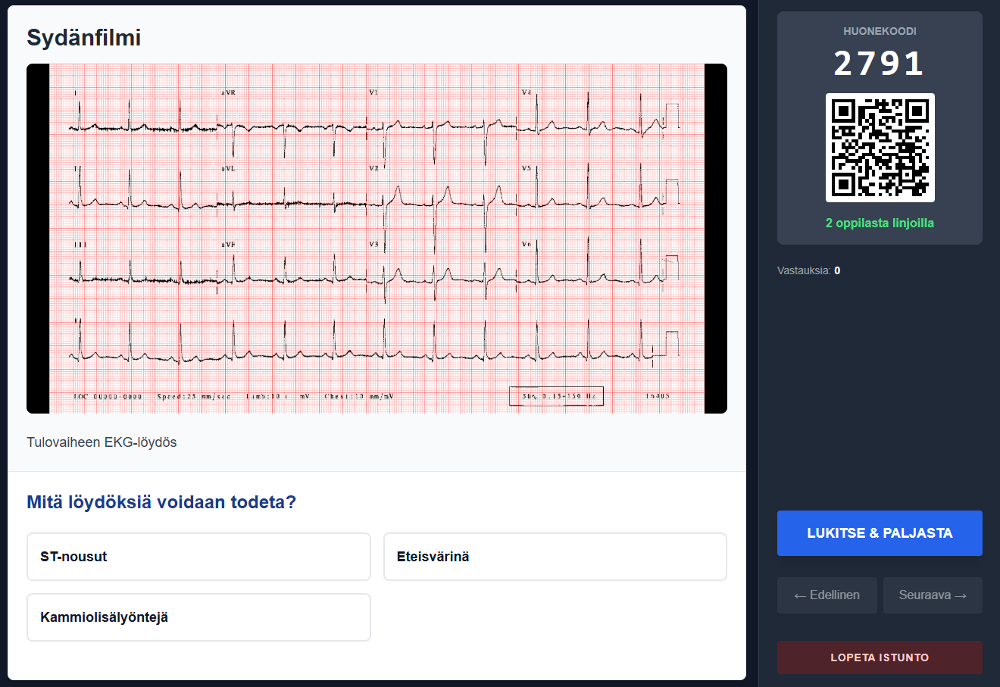
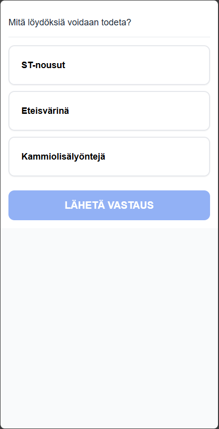

# MedCases

MedCases is an interactive teaching tool designed for medical education. It allows teachers to create, present, and conduct real-time quizzes based on patient cases.

## Features

-   **Interactive Presentations**: Teachers can present patient cases slide by slide.
-   **Real-time Quizzes**: Students answer questions (Multiple Choice, True/False, Open Text) in real-time using their devices.
-   **Live Results**: Teachers see student answers immediately (anonymously).
-   **Case Editor**: Built-in editor to create and modify `.medcase` files (ZIP archives containing JSON + images).
-   **Easy Joining**: Students join via a room code or by scanning a QR code.
-   **Dual Roles**: Unified landing page for both Students and Teachers.

## Screenshots

| Teacher View | Student View |
|:---:|:---:|
|  <br> *Control slides & see live results* |  <br> *Answer questions on mobile* |

## How It Works

### For Teachers
1.  **Create/Load a Case**: Use the built-in Editor to create a patient case or upload an existing `.medcase` file.
2.  **Start a Session**: Click "Start Session" to generate a unique 4-digit **Room Code**.
3.  **Share**: Show the Room Code or QR code to your students.
4.  **Present**: Navigate through slides. When a Question slide is shown, students can answer.
5.  **Review**: See incoming answers in real-time and reveal the correct answer when ready.

### For Students
1.  **Join**: Open the app on a phone or laptop.
2.  **Enter Code**: Type the 4-digit Room Code presented by the teacher.
3.  **Participate**: Wait for the teacher to present questions and submit your answers instantly.

## Architecture

This project uses a real-time **WebSocket** architecture to synchronize the teacher's state with all connected students.

-   **Server**: Node.js + Socket.io. Keeps track of active rooms, current slide, and student answers in-memory.
-   **Client**: React + Vite. Connects to the server.
    -   *Teacher Client*: Emits `PUSH_UPDATE` events when changing slides.
    -   *Student Client*: Listens for `SLIDE_UPDATE` events to render the current view.

## Logging & Docker

The server utilizes structured **Winston logging** instead of raw console outputs.

- **Development (`NODE_ENV=dev`)**: Logs are printed to the console in a friendly, color-coded fashion.
- **Production (`NODE_ENV=production`)**: Logs are output in raw **JSON format**, making them easy to scrape. 
- **Log Voluming**: Logs are simultaneously written to rotated files inside the `server/logs/` directory, archiving up to 14 days of history.

### Accessing Logs in Docker
When deploying via Docker, the recommended 12-factor standard is to access logs directly via standard output rather than entering the container filesystem. The Docker engine will capture the raw JSON lines.

To read live logs:
```bash
docker logs -f <your-container-name>
```

If you prefer to browse the rolling daily flat files, ensure you map a volume to `/app/server/logs/` when running the container, e.g.:
```bash
docker run -v /your/host/path/logs:/app/server/logs -p 3000:3000 medcases-server
```

## Documentation

For more detailed technical information, check the following docs:

-   [📥 Data Format Description](data-description.md) - Structure of the `.medcase` file and JSON schema.
-   [📂 Project Structure](project-structure.md) - Overview of the codebase layout and key files.
-   [🚀 Deployment Guide](DEPLOYMENT.md) - How to deploy using Docker.

## Tech Stack

-   **Frontend**: React, Vite, Tailwind CSS
-   **Backend**: Node.js, Socket.io
-   **Data Format**: Custom `.medcase` (ZIP) format

## Getting Started

1.  **Install dependencies**:
    ```bash
    npm run install-all
    ```

2.  **Start development servers** (Client + Server):
    ```bash
    npm run dev
    ```

3.  Open `http://localhost:5173` in your browser.

## Local Development

To run the application locally for development:

1.  **Install dependencies**:
    ```bash
    npm install
    # OR if you have a recursive install script
    npm run install-all
    ```

2.  **Start the development server**:
    This will start both the client (Vite) and the server (Node/Express).
    ```bash
    npm run dev
    ```
    - Client: http://localhost:5173
    - Server: http://localhost:3000
